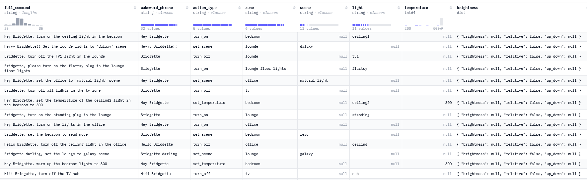

# Benchmarking Results

The file describes the results of benchmarking attempts against a, synthetically generated, [dataset](https://huggingface.co/datasets/mbary/hue_commands_synth_5k_v3) consisting of series of commands one would use to operate their smart-home light system.

## Dataset
### Generation
The dataset was generated using deepseek-v3-0324.
The generating script (alongside some data manipulation) can be found in /data/generate_data.py.

The latest version consists of ~5k samples. 
Each sample follows (roughly) the same pattern: <wakeword_phrase> \<action> \<parameters>. 

#### Wakeword phrase
The phrase was generated for future reference, as the ultimate goal is to have speech2text model continuously transcribing the text and triggering the system manipulation once the wakeword phrase is detected. 
The wakeword of my choice is "Hey Bridgette" (or just "Bridgette"). Why? Well, because all of the devices are connected and operated via a bridge, so I thought it would be funny to have "Bridgette" as the wakeword phrase. 

To increase robustness, I tried having numerous different variations of the phrase, however, they all **MUST** contain the word "Bridgette" in it.

#### Action
The command is any of the actions allowed by the Philips Hue system:
* Turn On
* Turn Off
* Set Scene
* Set Brightness
* Set (light) Temperature

#### Parameters
The parameters are values to be passed into the command. 
The are required and optional (action-specific) parameters. 
Required:
* zone - the zone where the action is to be executed 
  * Zones are user-defined collections of devices 
  
Optional:
* scene
  * A predefined (by the user or Philips) configuration of colours/dynamics for a zone
* light
  * A device connected to the bridge. Either a light or a smart plug
* temperature
  * The light temperature expressed in Kelvin, ranges between 153K and 500K.
* brightness
  * Brightness level, ranging beteen 0 and 100 units.
## Locally Served Model Results

## Larger Model Results