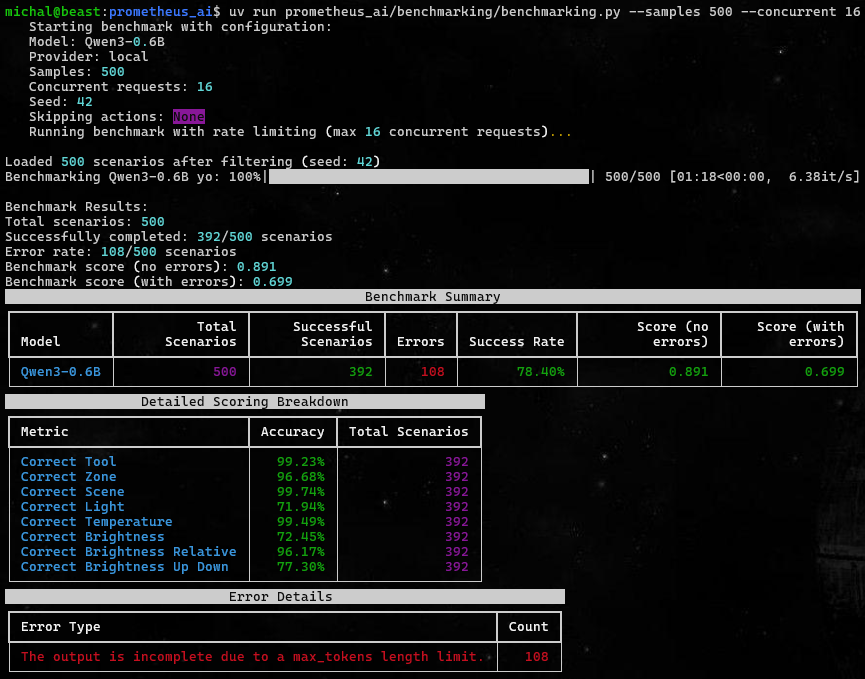
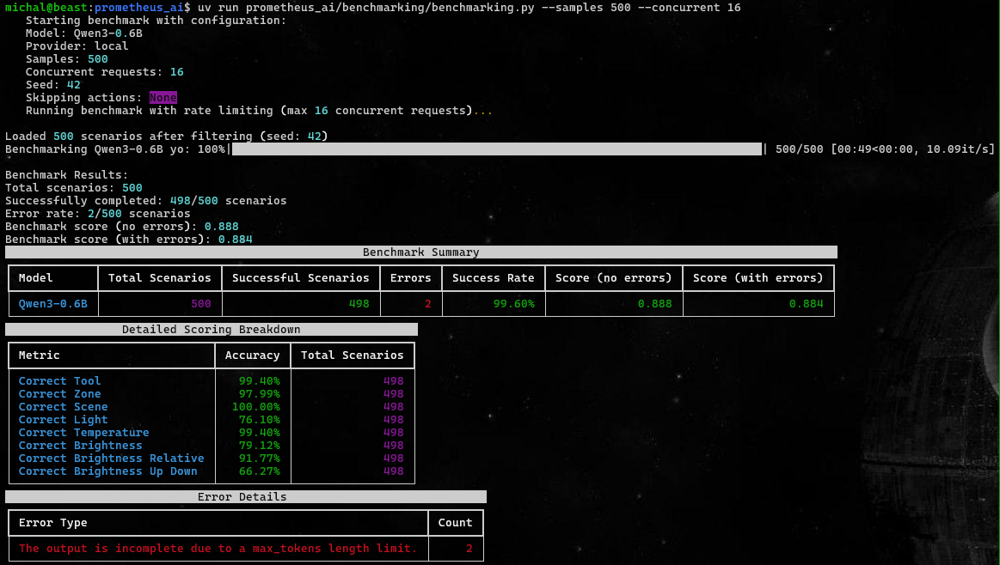
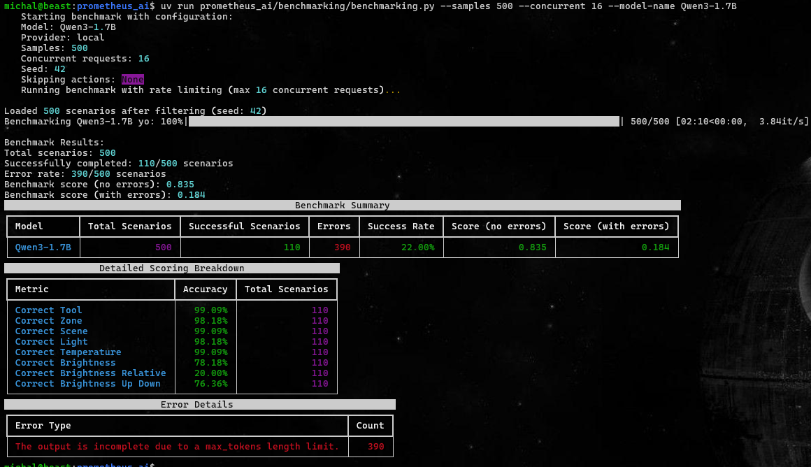
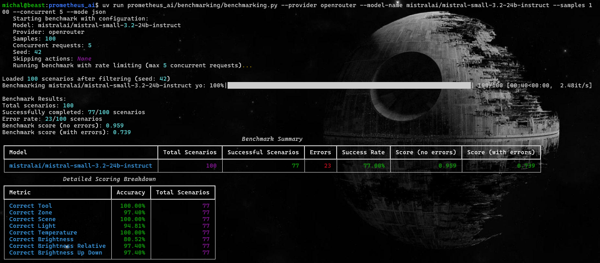

# Benchmarking Results

The file describes the results of benchmarking attempts against a, synthetically generated, [dataset](https://huggingface.co/datasets/mbary/hue_commands_synth_5k_v3) consisting of series of commands one would use to operate their smart-home light system.

## Methodology

The benchmarking is performed on the test split of the synthetic dataset. 
Locally served models will be benchmarked on 500 samples, while provider-hosted models will be benchmarked on a smaller subset of the dataset (because I'm not made of money and my money-tree is not fully grown yet). 

To ensure the benchmarking is fair, all models are evaluated on the same set of samples, using a predefined seed of 42. 

The models are being evaluated on their ability to correctly parse the commands and extract the parameters from them. 
The evaluation is done by comparing the model's output to the expected output. 
Due to the deterministic nature of the task at hand, the evaluation metrics themselves are also deterministic, simply comparing whether the generated value corresponds to the value from the synthetic dataset. 
The models are evaluated against the following metrics: 
**Required:**
* tool usage: was the correct tool selected.
* zone: was the correct zone identified. 

**Optional:** 
The optional parameters should be either \<parameter> or None
* scene
* light
* temperature
* brightness
* brightness relative: (does the user change brightness relatively to the current value, e.g. "increase brightness by 10%" or set a precise value, e.g. "set brightness to 50%")
* brightness up or down: (does the user want to increase or decrease the brightness)
  

### Local Model info:
Because I have a mid-tier GPU, I can only serve small models locally, by limiting the max token size to 4-5k tokens and having a varying number of concurrent requests, depending on the model size. 
Because the models are small, they have a tendency to spiral out of control, and hit the max token limit, by generating tens of thousands of empty lines, appended to a seemingly correct output. 
To account for that, the total Score is split into two parts:
* Score without Errors - considers only runs that ended successfully.
* Score with Errors - considers all runs, including those that errored out.

## Dataset
### Generation
The dataset was generated using deepseek-v3-0324.
The generating script (alongside some data manipulation) can be found in /data/generate_data.py.

The latest version consists of ~5k samples. 
Each sample follows (roughly) the same pattern: <wakeword_phrase> \<action> \<parameters>. 

#### Wakeword phrase
The phrase was generated for future reference, as the ultimate goal is to have speech2text model continuously transcribing the text and triggering the system manipulation once the wakeword phrase is detected. 
The wakeword of my choice is "Hey Bridgette" (or just "Bridgette"). Why? Well, because all of the devices are connected and operated via a bridge, so I thought it would be funny to have "Bridgette" as the wakeword phrase. 

To increase robustness, I tried having numerous different variations of the phrase, however, they all **MUST** contain the word "Bridgette" in it.

#### Action
The command is any of the actions allowed by the Philips Hue system:
* Turn On
* Turn Off
* Set Scene
* Set Brightness
* Set (light) Temperature

#### Parameters
The parameters are values to be passed into the command. 
There are required and optional (action-specific) parameters. 
Required:
* zone - the zone where the action is to be executed 
  * Zones are user-defined collections of devices 
  
Optional:
* scene
  * A predefined (by the user or Philips) configuration of colours/dynamics for a zone.
* light
  * A device connected to the bridge. Either a light or a smart plug.
* temperature
  * The light temperature expressed in Kelvin, ranges between 153K and 500K.
* brightness
  * Brightness level, ranging beteen 0 and 100 units.
## Locally Served Model Results
Selected models:
* [Qwen2.5-0.5B-Instruct](https://huggingface.co/Qwen/Qwen2.5-0.5B-Instruct)
* [Qwen2.5-1.5B-Instruct](https://huggingface.co/Qwen/Qwen2.5-1.5B-Instruct)
* [Qwen2.5-3B-Instruct](https://huggingface.co/Qwen/Qwen2.5-3B-Instruct)
* [Qwen3-0.6B](https://huggingface.co/Qwen/Qwen3-0.6B)
* [Qwen3-1.7B](https://huggingface.co/Qwen/Qwen3-1.7B)
* [Qwen3-4B](https://huggingface.co/Qwen/Qwen3-4B)
* [Qwen3-4B-AWQ](https://huggingface.co/Qwen/Qwen3-4B-AWQ)
* [Qwen3-4B-FP8](https://huggingface.co/Qwen/Qwen3-4B-FP8)

## Qwen Models
Initially, the models' performance varied significantly. 
Contrary to what one might expect, smaller models (especially the Qwen3 release) performed much better than their larger counterparts (successfully parsing the commands) with a 78.4% vs 22.8% success rate (prior to finetuning the parameters). 

Turns out that all models perform significatly better with the following changes:
* thinking_mode: disabled
* temperature: 0.2-0.7 
* presence_penalty: 1.5-1.9 
* top_p: 0.7-0.9 
* top_k: 20
* repetition_penalty: 1.05

However, what I am unable to explain is the reason why the larger 4B models, perform so poorly when it comes to parsing structured outputs, in comparison to their smaller versions.
Despite setting similar parameters (and experimenting with different values), the 4B models (regardless whether quantized or not) consistently underperform the smaller 0.6B and 1.7B models.

I suspect that larger models might require more guidance within the system prompts themselves, 
with a strictly defined template for the output, to ensure they produce the expected results. 
Though, theoretically, this is what the Instructor package is supposed to do, inject the tool JSON 
schema into the system prompt.

### Qwen3 vs Qwen2.5
It comes as no suprise that the newer release, Qwen3, significantly outperforms the Qwen2.5 family.

#### Qwen2.5-0.5B-Instruct
##### Initial Run

##### Improved Run
 

### Qwen2.5-1.5B-Instruct

#### Qwen2.5-3B-Instruct
##### Initial Run

##### Improved Run

## Qwen3 Model Family
Initially, the models' performance varied significantly. 
Contrary to what one might expect, the 0.6B model performed much better than the 1.7B model (in correctly parsing the tool calls.) with a 78.4% vs 22.8% success rate. 

Turns out that both models perform significatly better with the following changes:
* thinking_mode: disabled
* temperature: 0.7 (for 1.7B model) or 0.2 (for 0.6B model)
* presence_penalty: 1.5 
* top_p: 0.9 
* top_k: 20
* repetition_penalty: 1.05

However, what I am unable to explain is the reason why the larger 4B models, perform so poorly when it comes to parsing structured outputs, in comparison to their smaller versions.
Despite setting similar parameters (and experimenting with different values), the 4B models (regardless whether quantized or not) consistently underperform the smaller 0.6B and 1.7B models.

I suspect that larger models might require more guidance within the system prompts themselves, 
with a strictly defined template for the output, to ensure they produce the expected results. 
Though, theoretically, this is what the Instructor package is supposed to do, inject the tool JSON 
schema into the system prompt.
#### Qwen3-0.6B
##### Initial Run

##### Improved Run

#### Qwen3-1.7B
Initially, the 1.7B model's performance was atrocious, with it generating tens of thousands of empty lines, and failing to produce any meaningful output. 
However, after disabling thinking-mode, increasing the temperature to 0.7, and setting the presence penalty to 1.5, the model's performance improved significantly, reaching a whooping 99.8% success rate!. 
##### Initial Run

##### Improved Run

#### Qwen3-4B
##### Initial Run

##### Improved Run

#### Qwen3-4B-AWQ
##### Initial Run

##### Improved Run
 

#### Qwen3-4B-FP8
##### Initial Run

##### Improved Run

## Larger Model Results

## GPT Model Family
Unsurprisingly, the GPT models perform very well with this simple task (though do bear in mind they're benchmarked on a smaller sample size).
By using mode.TOOLS_STRICT, we're achieving 93-100% success rate, and high scores between from 0.89 to 0.98 (without errors). 
#### GPT-4.1-nano

#### GPT-4.1-mini

#### GPT-5-nano

#### GPT-5-mini

## Claude Model Family

#### Claude3-haiku

#### Claude3.5-haiku

#### Claude3.5-sonnet (v1)

## MoonshotAI Kimi K2

## Mistral Model Family

#### Mistral Small 3.2 24B Instruct

#### Mistral Nemo

## Gemini 2.5 Flash
