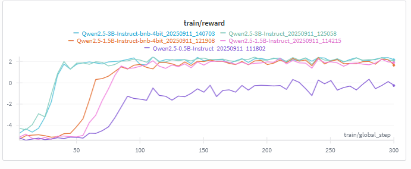
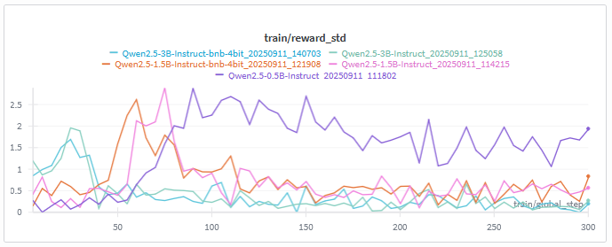
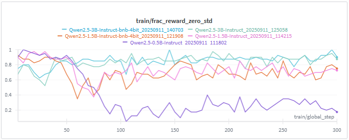
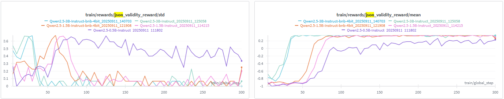
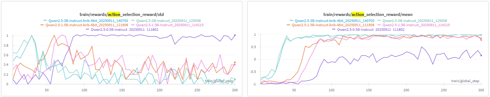
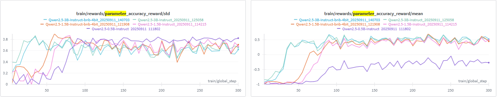
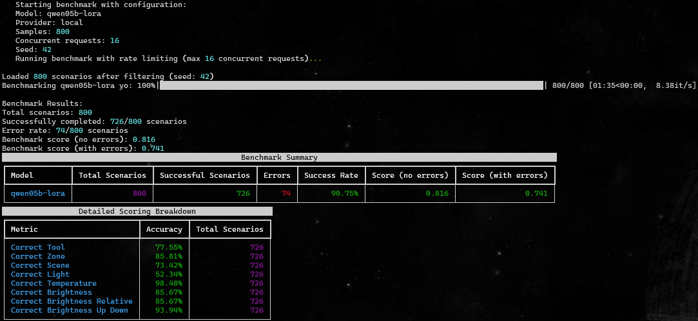
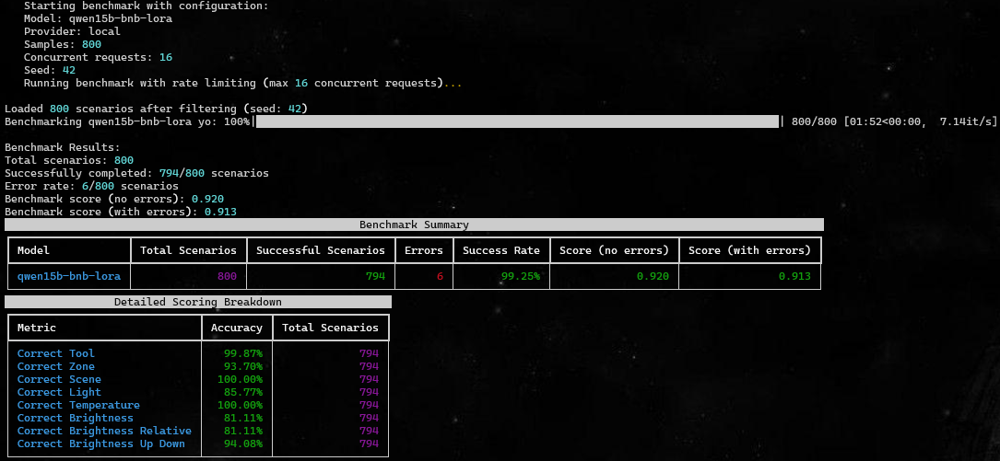
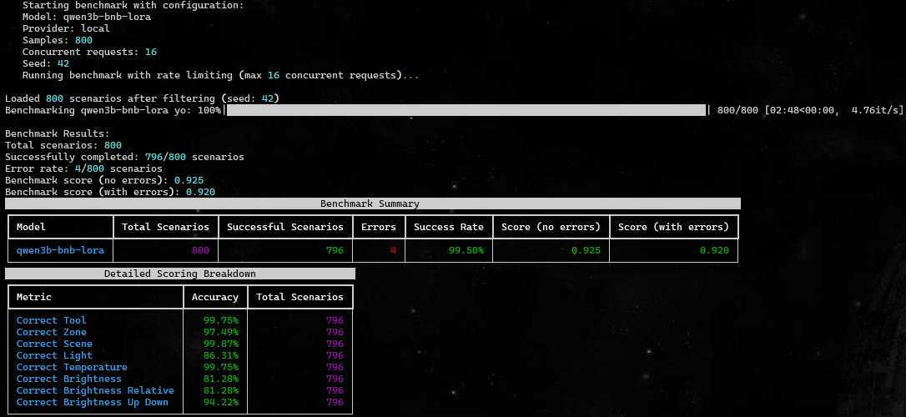
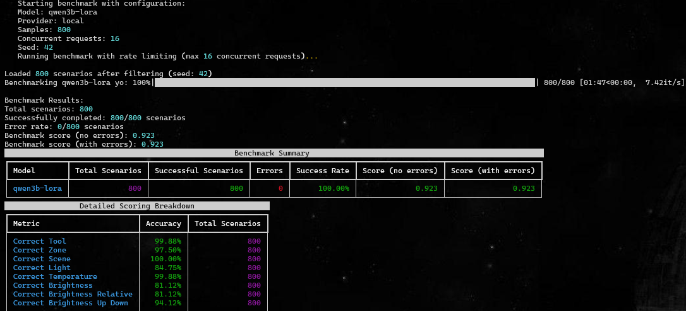

# Model Fine-Tuning


As shown in the [benchmarking results](../benchmarking/README.md) the smaller models were already quite capable when it cames to following instructions.<br>
However, they would still often struggle with correctly extracting command information from the user input.<br>
This is why I have decided to perform small fine-tuning experiments on the smaller models to see if I can improve their performance in argument parsing.

### NOTE
The initial benchmarking was implemented using pydantic structured outputs and instructor as the client patcher.<br>
As a result, the implemented agent was utilising tool-calls under the hood, without my explicit knowledge.<br>
Due to some instructor implementation quirks, I was unable to fine-tune a model with the same setup.<br>
I now understand both the limitations and advantages of frameworks such as instructor.<br>

For that reason I have decided to alter the agent design and am no longer relying on instructor/pydantic for structured outputs and am instead generating JSON outputs directly from the model followed by command parsing and tool calls.<br>

As a result, to provide comparable results, I had to adapt the benchmarking setup (/train/benchmarking.py) and re-run the benchmarks for the base models followed by the fine-tuned models.<br>

I will now provide a brief overview of the fine-tuning process and the results I have obtained.


## Changes vs Previous Design
As mentioned in the Note above, in order to perform fine-tuning I had to make some changes to my agent design.<br>
Following is a short summary of these changes:
1) Dropped the use of pydantic for structured outputs
2) Implemented direct JSON output generation from the model
3) Implemented custom parsing of the JSON output to extract command arguments
4) Implemented custom tool-calling logic based on the parsed arguments

## Initial Fine-Tuning

### GRPO
For my first Reinforcement Learning fine-tuning experiment I decided give GRPO a try.<br>
While a 'regular' SFT would likely suffice, I find the concept of rewards quite interesting and intuitive and it seemed like a good fit for my use case.<br>
Due to the physical limitations of my machine (a single 12GB GPU), I chose to fine-tune the 4bit quantized version by unsloth, the *unsloth/Qwen2.5-1.5B-Instruct-bnb-4bit* model following the LoRa GRPO approach by combining Unsloth's and HuggingFace's implementations of FastLanguageModel and GRPOTrainer.<br>
Though I am likely to attempt fine-tuning some other models too!<br>

#### Training Process
##### Overall Reward
From the graph, it seems like the steps (for all models) could be capped at around 100-125 steps, as the reward seems to plateau around that point.<br>


The following graph presents the standard deviation of total rewards per sample, within each training step.<br>
The 0.5B model (purple) exhibits the largest volatility, spiking to ~2–3 around 80–110 steps before decreasing, but elevated nonetheless (~1–2). <br>
That pattern matches a model oscillating between very good and very bad trajectories i.e., it’s exploring and frequently flipping between perfect parses and near misses.<br> 
Both 1.5B runs (orange/pink) display a significant bump in variance around 60–100 steps and then settle into a mid band (~0.3–0.8), suggesting partial stabilization with occasional swings.<br> 
In contrast, the 3B models (teal/blue) rapidly collapse to very low variance (<0.3) after ~70 steps and remain flat; their rewards are highly consistent from step to step.<br>



The 'frac_reward_zero_std' graph shows the frequency of samples receiving zero reward per training step.<br>
Usually due to invalid JSON outputs or completely incorrect actions.<br>
Lower and flatter is better, stable schema adherence.<br> 
In this run, the 0.5B model (purple) clearly stabilizes: it drops from ~0.9 to ~0.1 by ~110 steps and remains low, indicating it quickly locks onto the output format and keeps it.<br>
Both 1.5B variants (orange/pink) hover in the mid band (~0.4–0.7) with noticeable oscillations, suggesting  schema slips despite improving task behavior.<br> 
The 3B models (teal/blue) sit highest (~0.7–0.95) and stay unstable throughout training. They appear to keep exploring diverse outputs at the cost of consistent formatting. <br>
Overall, the plot reveals a size-dependent pattern: as capacity grows, these models achieve strong task competence but exhibit less stable adherence to the strict JSON interface under the current training setup, whereas the compact 0.5B model converges to consistently valid and therefore rarely zero-reward—outputs.<br>


##### JSON Validity
In the following JSON validity reward graphs the two 3B models surge from negative reward to ~0.8–0.9 mean by ~60–80 steps and then track flat, indicating near-always valid JSON.<br> 
The 1.5B (4-bit) follows with a delayed but similar rise, stabilizing just under the 3B ceiling. <br>
The 0.5B model is slower-crossing zero only around ~90–110 steps—and plateaus noticeably lower, reflecting occasional incorrect outputs late into training. The left plot (std) reinforces this: variance is high during the early ramp (40–80 steps), collapses to near-zero for the 3B and 1.5B runs once they lock into the schema, but remains elevated and spiky for the 0.5B, consistent with intermittent formatting regressions.<br> 
Overall, JSON correctness becomes a solved behavior for larger models while the smallest run retains residual instability.<br>


##### Action Selection
Across runs, the 3B models ramp to near-perfect tool choice (~0.9–1.0 mean) by ~60–80 steps and then stay flat, with very low variance afterwards (std trending toward ~0.1 or less).<br> 
The 1.5B 4-bit line follows a similar trajectory but with a slower climb and modest oscillations, it stabilizes slightly below the 3B ceiling. <br>
The 0.5B model lags: it doesn’t reliably cross zero until ~90–110 steps and plateaus well under the others, with noticeably higher dispersion later in training. The left plot (std) mirrors this: variance spikes during the 40–90 step transition, then collapses for the 3B runs while remaining elevated and jagged for the 0.5B.<br> 
Overall: larger models learn the correct action type quickly and consistently while the small model is both slower and less stable, suggesting residual ambiguity in tool selection.<br>


##### Parameter Extraction Accuracy
Across runs, the 3B models climb fastest from negative to ~0.45–0.6 mean reward by ~60–90 steps and stay there, indicating solid matching of required fields (scene, light, temperature/brightness) to the scenario.<br> 
The 1.5B models trail slightly, settling around ~0.4–0.55, while the 0.5B model lags—remaining near zero until ~100 steps and only reaching ~0.15–0.25 by step 300. <br>
The std plot stays relatively high (~0.6–0.8) for all models, i.e., per-batch accuracy is uneven: some scenarios are nailed while others still miss specific arguments. That persistent variance suggests parameter difficulty is normal across models (e.g., light names vs. exact numeric values), even as larger models deliver the best overall parameter accuracy.


#### Training Data
For the training data I used the same dataset as for my initial approach at benchmarking (see [here](../benchmarking/README.md#training-data)).<br>
For a quick summary, the dataset consists of ~5k commands, specific to the Philips Hue ecosystem, 4000 for training and 980 for testing, with a variety of user commands and corresponding actions.<br>
It was generated using deepseek-v3-0324, utilising pydantics structured outputs, to ensure adherence to some predefined rules.<br>

The command is any of the actions allowed by the Philips Hue system:
* Turn On
* Turn Off
* Set Scene
* Set Brightness
* Set (light) Temperature

##### Parameters
The parameters are values to be passed into the command.<br>
There are required and optional (action-specific) parameters.<br>
Required:
* zone - the zone where the action is to be executed<br>
  * Zones are user-defined collections of devices<br>
  
Optional:
* scene
  * A predefined (by the user or Philips) configuration of colours/dynamics for a zone.
* light
  * A device connected to the bridge. Either a light or a smart plug.
* temperature
  * The light temperature expressed in Kelvin, ranges between 153K and 500K.
* brightness
  * Brightness level, ranging beteen 0 and 100 units.

#### Reward Functions
For the reward functions I have implemented a custom set of functions, specific to my use case.<br>
The reward functions are implemented in [reward_funcs.py](./reward_funcs.py) and are briefly described below:
1) **JSON Validity** - Is the output a valid JSON, if not, returns a negative reward
2) **Action Type Correctness** - Does the selected action type match the expected action
3) **Zone Selection** - Is the selected zone matching the expected zone (this is one of the required parameters)
4) **Brightness Control** - Checks if the brightness parameters are correct (set if set_brightness else null)
5) **Parameter Accuracy** - Checks if the rest of provided parameters match the expected values.
6) **Extraneous Parameter Penalty** - Penalises any non-required arguments e.g. providing a brightness value when action is 'turn_on'

So initially I finetuned the models that would esentially output the following JSON structure:

```json
{
    "think": "Your reasoning for this action",
    "action_type": "turn_on|turn_off|set_scene|set_brightness|set_temperature",
    "command": {
        "zone": "office|lounge|lounge floor lights|bedroom|all|tv",
        "light": "light_name or null",
        "scene": "scene_name or null", 
        "temperature": "number_or_null",
        "brightness": {
            "brightness": "number_or_null",
            "relative": "True|False",
            "up_down": "up|down or null"
        }
    }
}
```
The output would then be parsed and the relevant tool would be called with the extracted arguments.<br>


## Benchmarking
Each benchmarked model was served locally on my machine, with the same parameters:
```shell
vllm serve $UNSLOTH_QWEN25_1_5_INSTRUCT --served-model-name base-qwen15b-bnb4 --quantization bitsandbytes --load-format bitsandbytes --max-model-len 4096 --max-num-batched-tokens 12000 --max-num-seqs 16 --enable-chunked-prefill --gpu-memory-utilization 0.6
```
Enabling up to 16 concurrent sequences, with 4096 token context length (with the system prompt taking up ~720 tokens - depending on the tokenizer), benchmarking 800 samples took up 64 seconds! (varies slightly depending on the model)<br>


### Models
#### Base Models
All benchmarked models are the 'instruct' variants of the models.<br>
To showcase the power of finetuning, let's first look at the 'base' models:
- Qwen2.5 1.5B Instruct 
- Qwen2.5 1.5B BNB4 by Unsloth
  
As you can see, both models perform are quite good when it comes to parsing the user command, however, they perform incredibly poorly in outputing the actual JSON structure.<br> 
Meaning that IF they manage to output the correct JSON structure, they are very likely to have the correct arguments.<br>
Neither of the models managed to get above 30% success rate!

##### Qwen2.5 1.5B Instruct


##### Qwen2.5 1.5B BNB4 by Unsloth

#### Fine-tuned Model qwen2.5-1.5B-bnb4

The fine-tuned model performed significantly better than the base models, achieving an amazing 90% success rate!
While it performed slightly worse in parsing the correct arguments, it managed to output the correct JSON on a way more consistent basis.<br> 


## Identified Issues
This was quite a learning experience. Throughout the process I identified several issues with my approach/undestanding of the matter:
1. **The nested structure**, with similar naming convention (brightness:{brightness...}) proved to be too confusing for the tiny models. 

2. The **lack of standardised argument** values added unnecessary confusion i.e. in some cases, for the brightness param, the argument would be value|null whereas in other cases it would be value|bool, which meant the model got confused which is which, resulting in invalid outputs.

3. The **lack of examples** for certain commands (i.e. set_brightness) meant the model struggled to understand how to use them.

4. **Insufficient penalisation** for incorrect arguments, especially in areas most challenging to the model e.g. distinguishing between relative and absolute brightness values.

5. **Ambiguous instructions** in the system prompt, especially around brightness control, led to inconsistent interpretations by the model.

6. **Insufficient training samples** of fractional brightness values (for commands such as "increase brightness by X%") led to the model struggling to understand how to represent them correctly in JSON.

7. **Low quality data points** having carefully inspecting the dataset, I've identified a number of samples that were of low quality. While the parameters themselves were correct, it turned out that, despite my best efforts to guide the dataset generating model, some of the commands lacked crucial information, required for successfull parsing of the commands. Mainly, they did not explicitly mention the zone in which an operation was to be executed. While some of the larger models were able to overcome it (due to some prompt/context engineering on my side) it posed an issue for the smaller models.

## Solutions

1. **Simplify the JSON structure** to reduce nesting and make it easier for the model to understand.

2. **Standardise argument formats** across all commands to reduce confusion (e.g., always use value|null).

3. **Increase the number of examples** for underrepresented commands to help the model learn their (though this will be done by secondary fine-tuning, with a smaller learning rate and number of steps).

4. **Prompt/Context Engineering** - Clarify instructions in the system prompt, especially around areas where the model struggled (e.g., brightness control). Provide more few-shot examples to guide the model. Dynamically generate the system prompt, ensuring it contains an up-to-date list of Hue resources.

5. **Dataset Preparation** - Ensure the generated dataset is fully consistent and adheres to the predefined set of rules. This includes ensuring that all commands are represented correctly and that there are no conflicting examples or values.

## Improved Fine-Tuning
Based on the identified issues and proposed solutions, I have made several adjustments to my fine-tuning experiment.<br>
By providing more specific instructions in the system prompt, simplifying the JSON structure, standardising argument formats, and slightly amending the existing dataset, I aimed to address the challenges faced by the model.<br>
The results are quite astonishing, by merely simplifying the output JSON stucture, improving the dataset and clarifying the system prompt, I managed to achieve a whopping 98.7% success rate!<br>
Not only did the overall success rate improve by over 8%, parsing of the individual arguments has improved dramatically, increasing the brightness value from 34% to 81%!!<br>

It comes as no surprise that the larger models perform much better, achieving almost a perfect score in returning the correctly parsed JSON structure.<br>
Another unsurprising result is the fact that the non-quantized models outperform their nerfed counterparts.<br>
However, due to the end goal of running the model on a local machine, I am more interested in the performance of the smaller, 0.5B models.<br>
The results are quite amazing, the tiny 0.5B model achieves a very respectable 90% success rate and manages to correctly parse the arguments across the board.<br>
The fact that such a small model performs so well allows my entire system to run on a single 12GB GPU, with very low latency, high throughput and still have some memory left for other tasks.<br>

This proves the importance of several things when it comes to working with and fine-tuning LLMs:
1) Clear and unambiguous instructions

2) Simple and easy to understand output structure

3) Consistent and well-prepared dataset - **ALWAYS** look at your dataset! Its better to spend a few days ensuring top quality than have to struggle with training a model.

### Benchmarking Results - Improved Fine Tuning Process


#### Qwen2.5 0.5B Instruct



#### Qwen2.5-1.5B-bnb4-Instruct (quantized)


#### Qwen2.5-1.5B-Instruct (non-quantized)


#### Qwen2.5-3B-bnb4-Instruct (quantized)


#### Qwen2.5-3B-Instruct

