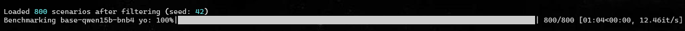
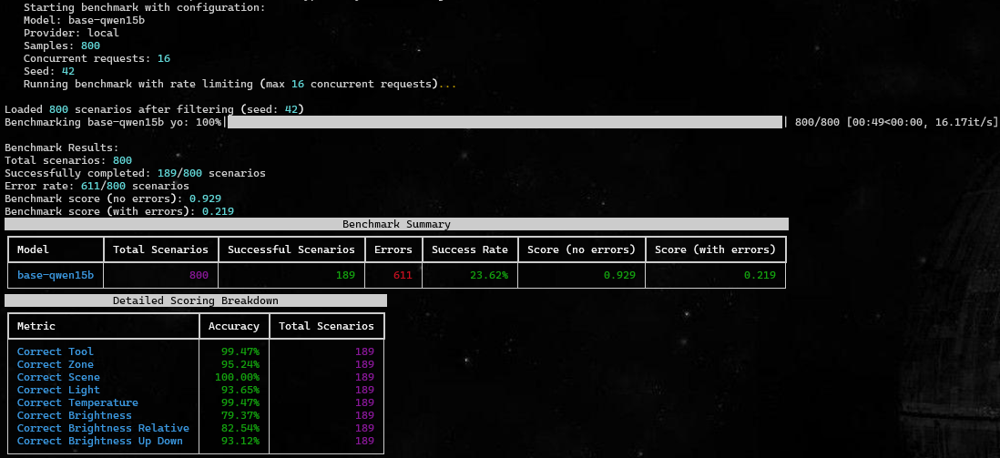
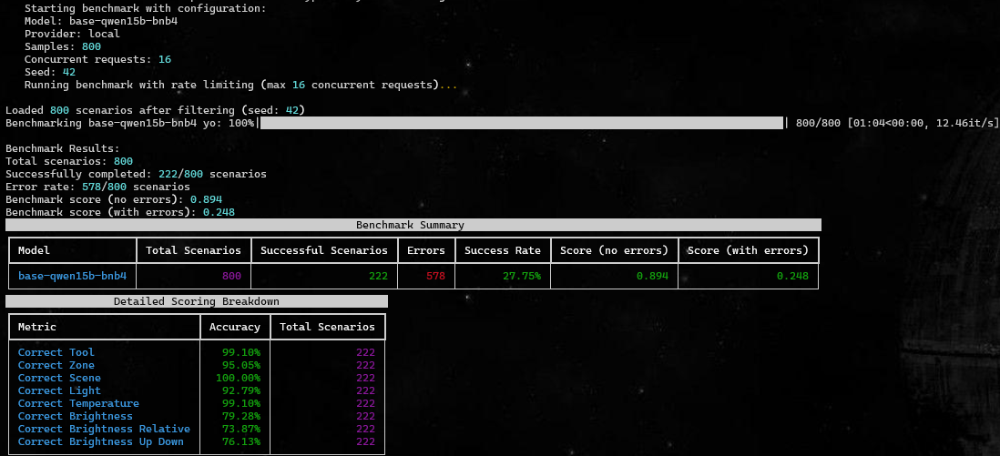
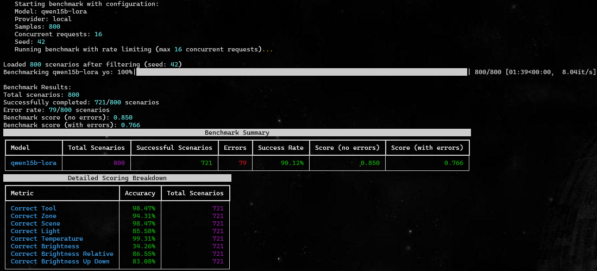

# Model Fine-Tuning


As shown in the [benchmarking results](../benchmarking/README.md) the smaller models were already quite capable when it cames to following instructions.<br>
However, they would still often struggle with correctly extracting command information from the user input.<br>
This is why I have decided to perform small fine-tuning experiments on the smaller models to see if I can improve their performance in argument parsing.

### NOTE
The initial benchmarking was implemented using pydantic structured outputs and instructor as the client patcher.<br>
As a result, the implemented agent was utilising tool-calls under the hood, without my explicit knowledge.<br>
Due to some instructor implementation quirks, I was unable to fine-tune a model with the same setup.<br>
I now understand both the limitations and advantages of frameworks such as instructor.<br>

For that reason I have decided to alter the agent design and am no longer relying on instructor/pydantic for structured outputs and am instead generating JSON outputs directly from the model followed by command parsing and tool calls.<br>

As a result, to provide comparable results, I had to adapt the benchmarking setup (/train/benchmarking.py) and re-run the benchmarks for the base models followed by the fine-tuned models.<br>

I will now provide a brief overview of the fine-tuning process and the results I have obtained.


## Changes vs Previous Design
As mentioned in the Note above, in order to perform fine-tuning I had to make some changes to my agent design.<br>
Following is a short summary of these changes:
1) Dropped the use of pydantic for structured outputs
2) Implemented direct JSON output generation from the model
3) Implemented custom parsing of the JSON output to extract command arguments
4) Implemented custom tool-calling logic based on the parsed arguments

## Initial Fine-Tuning

### GRPO
For my first Reinforcement Learning fine-tuning experiment I decided give GRPO a try.<br>
While a 'regular' SFT would likely suffice, I find the concept of rewards quite interesting and intuitive and it seemed like a good fit for my use case.<br>
Due to the physical limitations of my machine (a single 12GB GPU), I chose to fine-tune the 4bit quantized version by unsloth, the *unsloth/Qwen2.5-1.5B-Instruct-bnb-4bit* model following the LoRa GRPO approach by combining Unsloth's and HuggingFace's implementations of FastLanguageModel and GRPOTrainer.<br>
Though I am likely to attempt fine-tuning some other models too!<br>

#### Training Data
For the training data I used the same dataset as for my initial approach at benchmarking (see [here](../benchmarking/README.md#training-data)).<br>
For a quick summary, the dataset consists of ~5k commands, specific to the Philips Hue ecosystem, 4000 for training and 980 for testing, with a variety of user commands and corresponding actions.<br>
It was generated using deepseek-v3-0324, utilising pydantics structured outputs, to ensure adherence to some predefined rules.<br>

The command is any of the actions allowed by the Philips Hue system:
* Turn On
* Turn Off
* Set Scene
* Set Brightness
* Set (light) Temperature

##### Parameters
The parameters are values to be passed into the command.<br>
There are required and optional (action-specific) parameters.<br>
Required:
* zone - the zone where the action is to be executed<br>
  * Zones are user-defined collections of devices<br>
  
Optional:
* scene
  * A predefined (by the user or Philips) configuration of colours/dynamics for a zone.
* light
  * A device connected to the bridge. Either a light or a smart plug.
* temperature
  * The light temperature expressed in Kelvin, ranges between 153K and 500K.
* brightness
  * Brightness level, ranging beteen 0 and 100 units.

#### Reward Functions
For the reward functions I have implemented a custom set of functions, specific to my use case.<br>
The reward functions are implemented in [reward_funcs.py](./reward_funcs.py) and are briefly described below:
1) **JSON Validity** - Is the output a valid JSON, if not, returns a negative reward
2) **Action Type Correctness** - Does the selected action type match the expected action
3) **Zone Selection** - Is the selected zone matching the expected zone (this is one of the required parameters)
4) **Brightness Control** - Checks if the brightness parameters are correct (set if set_brightness else null)
5) **Parameter Accuracy** - Checks if the rest of provided parameters match the expected values.
6) **Extraneous Parameter Penalty** - Penalises any non-required arguments e.g. providing a brightness value when action is 'turn_on'

So initially I finetuned the models that would esentially output the following JSON structure:

```json
{
    "think": "Your reasoning for this action",
    "action_type": "turn_on|turn_off|set_scene|set_brightness|set_temperature",
    "command": {
        "zone": "office|lounge|lounge floor lights|bedroom|all|tv",
        "light": "light_name or null",
        "scene": "scene_name or null", 
        "temperature": "number_or_null",
        "brightness": {
            "brightness": "number_or_null",
            "relative": "True|False",
            "up_down": "up|down or null"
        }
    }
}
```
The output would then be parsed and the relevant tool would be called with the extracted arguments.<br>


## Benchmarking
Each benchmarked model was served locally on my machine, with the same parameters:
```shell
vllm serve $UNSLOTH_QWEN25_1_5_INSTRUCT --served-model-name base-qwen15b-bnb4 --quantization bitsandbytes --load-format bitsandbytes --max-model-len 4096 --max-num-batched-tokens 12000 --max-num-seqs 16 --enable-chunked-prefill --gpu-memory-utilization 0.6
```
Enabling up to 16 concurrent sequences, with 4096 token context length (with the system prompt taking up ~720 tokens - depending on the tokenizer), benchmarking 800 samples took up 64 seconds! (varies slightly depending on the model)<br>



### Models
#### Base Models
All benchmarked models are the 'instruct' variants of the models.<br>
To showcase the power of finetuning, let's first look at the 'base' models:
- Qwen2.5 1.5B Instruct 
- Qwen2.5 1.5B BNB4 by Unsloth
  
As you can see, both models perform are quite good when it comes to parsing the user command, however, they perform incredibly poorly in outputing the actual JSON structure.<br> 
Meaning that IF they manage to output the correct JSON structure, they are very likely to have the correct arguments.<br>
Neither of the models managed to get above 30% success rate!
##### Qwen2.5 1.5B Instruct


##### Qwen2.5 1.5B BNB4 by Unsloth

#### Fine-tuned Model

The fine-tuned model performed significantly better than the base models, achieving an amazing 90% success rate!
While it performed slightly worse in parsing the correct arguments, it managed to output the correct JSON on a way more consistent basis.<br> 



## Identified Issues
This was quite a learning experience. Throughout the process I identified several issues with my approach/undestanding of the matter:
1. **The nested structure**, with similar naming convention (brightness:{brightness...}) proved to be too confusing for the tiny models. 

2. The **lack of standardised argument** values added unnecessary confusion i.e. in some cases, for the brightness param, the argument would be value|null whereas in other cases it would be value|bool, which meant the model got confused which is which, resulting in invalid outputs.

3. The **lack of examples** for certain commands (i.e. set_brightness) meant the model struggled to understand how to use them.

4. **Insufficient penalisation** for incorrect arguments, especially in areas most challenging to the model e.g. distinguishing between relative and absolute brightness values.

5. **Ambiguous instructions** in the system prompt, especially around brightness control, led to inconsistent interpretations by the model.

6. **Insufficient training samples** of fractional brightness values (for commands such as "increase brightness by X%") led to the model struggling to understand how to represent them correctly in JSON.

## Potential Solutions

1. **Simplify the JSON structure** to reduce nesting and make it easier for the model to understand.

2. **Standardise argument formats** across all commands to reduce confusion (e.g., always use value|null).

3. **Increase the number of examples** for underrepresented commands to help the model learn their (though this will be done by secondary fine-tuning, with a smaller learning rate and number of steps).

4. **Prompt Engineering** - Clarify instructions in the system prompt, especially around areas where the model struggled (e.g., brightness control). Provide more few-shot examples to guide the model.


